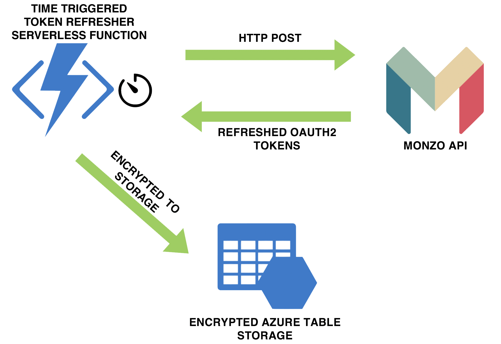

## Architecture diagram

#### Rationale

Based on OAuth best practice, [Monzo Bank API](https://docs.monzo.com/) access tokens expire after a number of hours. 

Refreshing the token on the server-side requires knowledge of the previous access and refresh tokens issued. Without a background service that refreshes the tokens 

This microservice that automatically refreshes Monzo API access tokens based on a specified amount of time, and makes them accessible to other microservices looking to interface with the Monzo API

